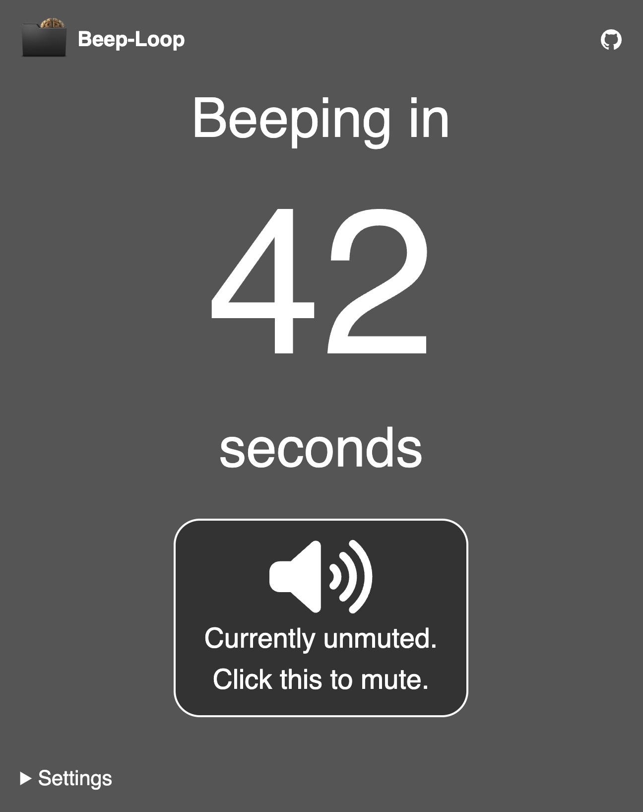

# Beep-Loop

*Beep-Loop* runs a timer over and over again. Every time the timer reaches zero, it beeps.

## Settings

You can adjust the timer in some ways:

* loop duration in seconds (default 60)
* frequency in hertz (default 440)
* volume in percent (default 50)
* beep duration in milli seconds (default 50)

## Installation

This repo can simply be cloned on a web server for installation, adaptation and personal use. Remove the 2 lines of PHP code in `index.php` and reactivate and adapt the HTML code lines below. The `index.php` can then also be renamed to `index.html`.
